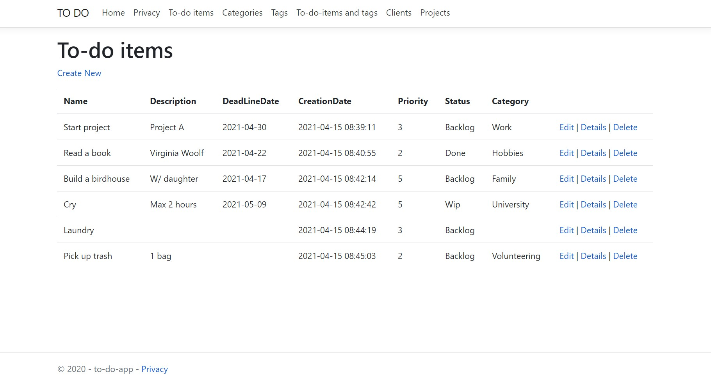
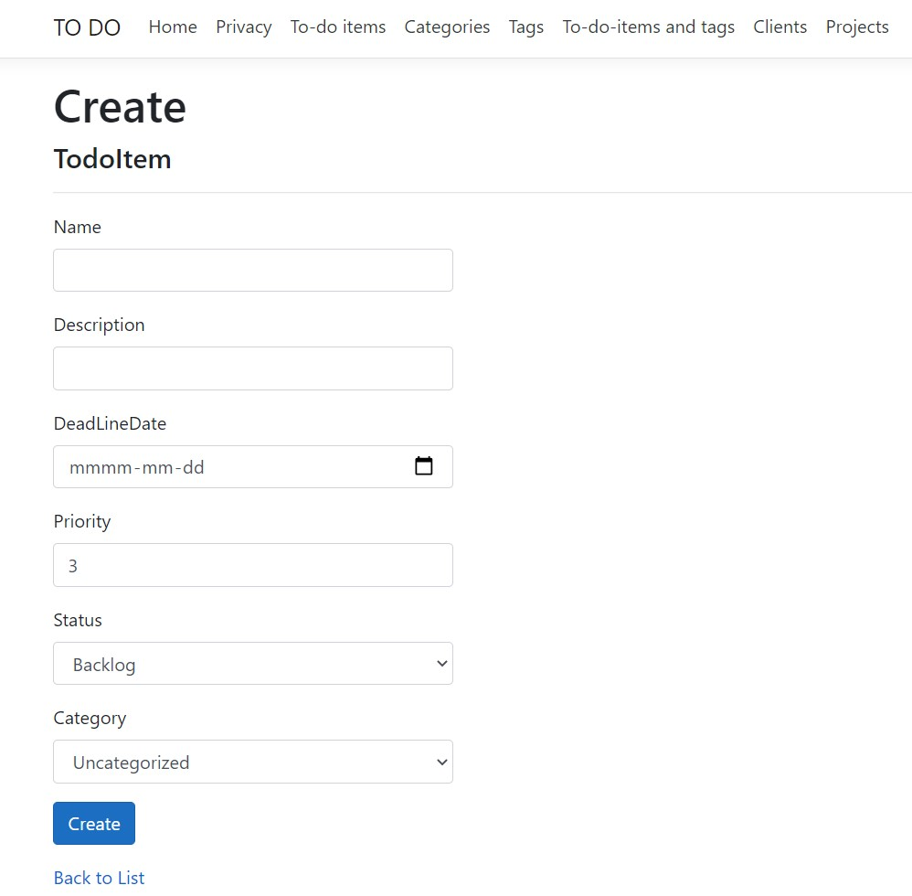
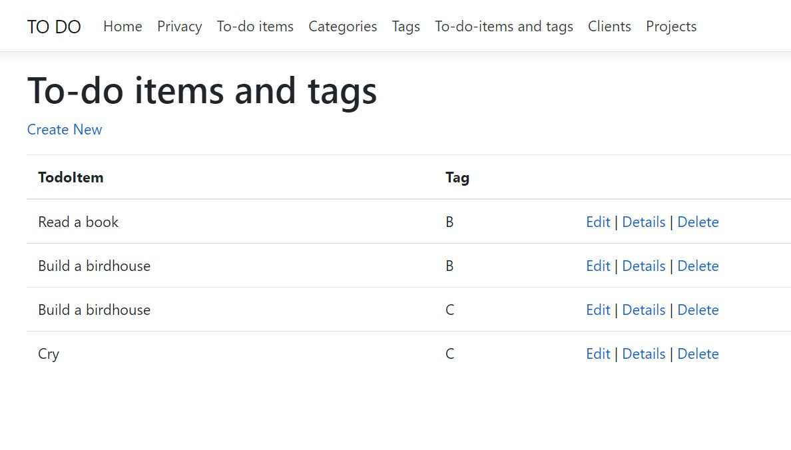
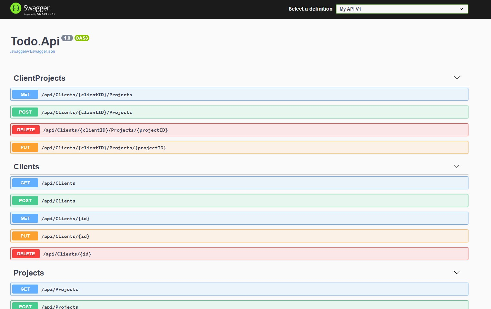

# To do list

ASP.NET core web application with API, developed for the ASP.NET core course, organized by Alna Software in 2020.

## Features

- Viewing lists of tasks, categories, tags, tasks and tags matches, clients and projects
- Creating, editing and deleting tasks, categories and tags using web user interface
- Multiple tasks assignment to a category (many to one relationship)
- Matching tasks with tags (many to many relationship)
- Creating, editing and deleting clients and projects using API
- Assigning projects to a client using API

## User interface

## API (Swagger UI)

